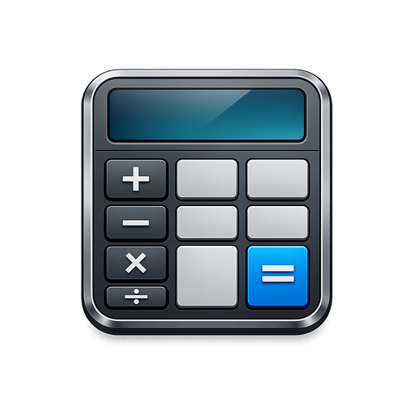
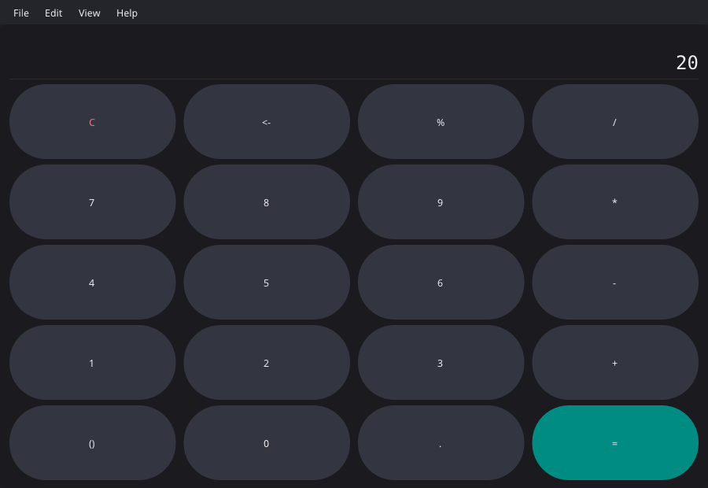
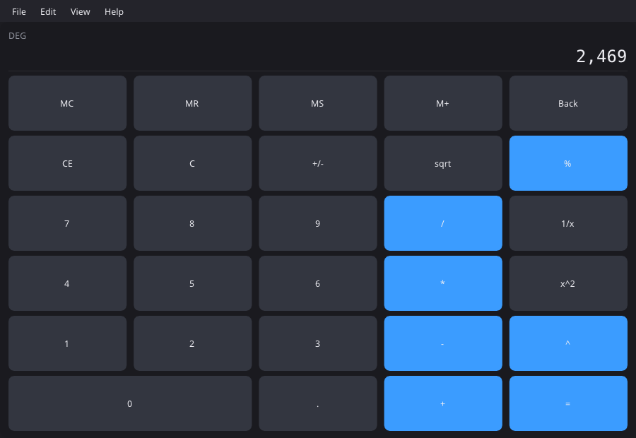
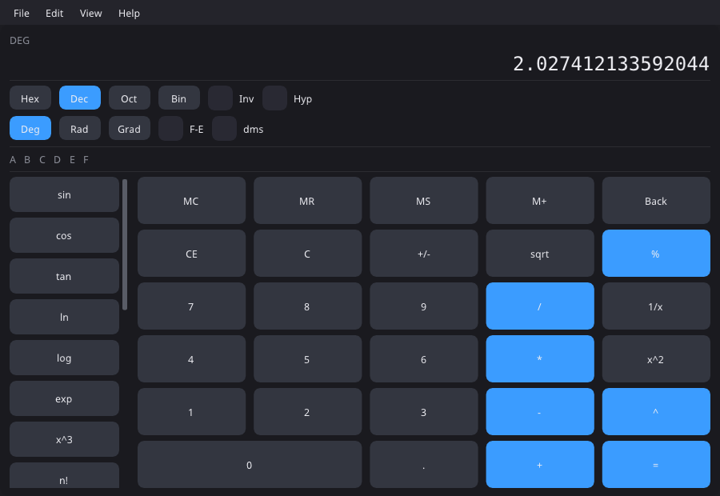
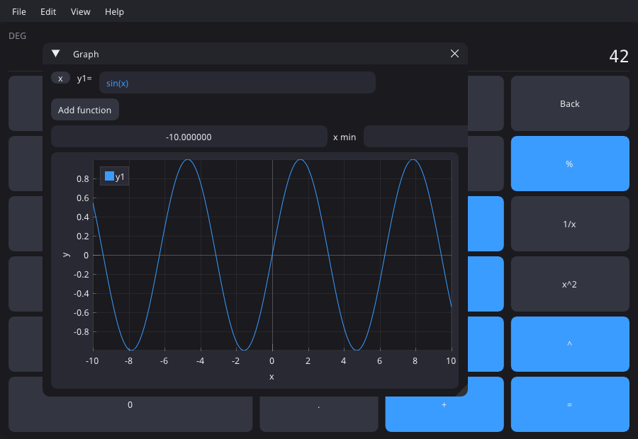

<!-- SPDX-License-Identifier: GPL-3.0-only -->

<p align="center">
  
</p>

<h1 align="center">Zigulator</h1>

<p align="center">
  <strong>A modern desktop calculator built with Zig and Dear ImGui.</strong>
</p>

<p align="center">
  Fast everyday arithmetic, scientific functions, expression evaluation,
  graphing, history, and statistics in one native desktop window.
</p>

<p align="center"><strong>Version 0.1.2</strong></p>

Zigulator combines a clean calculator interface with a GUI-independent Zig
core. It offers familiar button-driven calculation while adding expression
paste, multiple number bases, dockable tools, and English or Brazilian
Portuguese UI text.

## Gallery

<p align="center">
  
  &nbsp;
  
</p>
<p align="center">
  <em>Simple</em>&nbsp;&nbsp;·&nbsp;&nbsp;<em>Standard</em>
</p>

<p align="center">
  
  &nbsp;
  
</p>
<p align="center">
  <em>Scientific</em>&nbsp;&nbsp;·&nbsp;&nbsp;<em>Graph</em>
</p>

## Why Zigulator?

- **Three calculator modes**: Simple, Standard, and Scientific layouts cover
  quick arithmetic through trigonometry, logarithms, powers, factorials, and
  bitwise operations.
- **Expression evaluation**: paste complete expressions such as
  `sqrt(3) + 2^4`, with standard precedence, constants, functions, and
  base-prefixed literals.
- **Function graphing**: plot up to eight expressions, adjust the x range,
  and pan or zoom through ImPlot.
- **Useful side tools**: recall completed calculations from History and build
  datasets with count, sum, mean, and sample standard deviation.
- **Keyboard-first operation**: digits, operators, clear keys, clipboard
  actions, scientific shortcuts, angle units, and bases all have key bindings.
- **Localized display**: switch between English and Brazilian Portuguese and
  choose `.` or `,` as the decimal separator.
- **Testable core**: parsing, formatting, calculator state, history,
  statistics, and localization run without the GUI.

## Requirements

Zigulator targets Zig 0.16.0 and is currently verified on Linux x86_64. Running
the GUI requires a graphical session and an OpenGL 4.0-capable driver. The
first build needs network access to fetch the pinned zgui, zglfw, zopengl, and
system SDK dependencies from `build.zig.zon`.

## Install (Arch Linux)

Stable package on the AUR:

```bash
yay -S zigulator
# or: paru -S zigulator
```

## Build from source

Install Zig 0.16.0, then run from the repository root:

```bash
zig version
zig build test
zig build -Doptimize=ReleaseFast
./zig-out/bin/zigulator
```

For a development run:

```bash
zig build run
```

This workspace may have Zig installed at
`tools/zig-x86_64-linux-0.16.0/zig`; use that path in place of `zig` when
needed. If a Linux build fails on `.sframe` relocations, generate the local CRT
workaround and rebuild:

```bash
scripts/gen-crt-nosframe.sh
zig build
```

## Quick start

1. Launch Zigulator. It starts in Standard mode.
2. Choose **View → Simple**, **Standard**, or **Scientific**.
3. Enter values with the keypad or keyboard. Press Enter or `=` to evaluate.
4. Open **View → History**, **Graph**, or **Statistics** for dockable tools.
5. Use **Edit → Paste** or Ctrl+V to evaluate a complete clipboard expression.

Button calculations execute as operations are entered, like a classic desktop
calculator. Thus button input `2 + 3 * 4 =` produces `20`. Pasted expressions
use parser precedence, so pasting `2 + 3 * 4` produces `14`.

Full walkthrough: [Using Zigulator](docs/usage.md).

## Calculator modes

| Mode | Best for | Main controls |
| ---- | -------- | ------------- |
| Simple | Compact arithmetic | digits, operators, percent, backspace, smart parentheses |
| Standard | Daily calculation | memory, CE/C, square root, reciprocal, square, power |
| Scientific | Advanced work | trig, logs, factorial, constants, bases, bitwise operations, angle and display modes |

Scientific mode supports Hex, Dec, Oct, and Bin displays; Deg, Rad, and Grad
angles; `Inv` and `Hyp` modifiers; and `F-E` and `dms` display toggles. The
`Sta` button opens the Statistics window.

## Expressions and graphing

Clipboard expressions accept `+`, `-`, `*`, `/`, `mod`, `^`, `**`, `!`, `%`,
parentheses, bitwise operators, and shifts. Available functions include
`sqrt`, `sin`, `cos`, `tan`, `asin`, `acos`, `atan`, `ln`, `log`, `exp`, and
`abs`; constants include `pi` and `e`.

```text
2 * -3
(2 + 5)^3
sin(pi / 2)
0xFF & 0b1111
5! + sqrt(9)
```

Open **View → Graph** to edit `y1=`, add functions, and set `x min` and
`x max`. Graph expressions bind `x` and always interpret trigonometric input
in radians.

## Keyboard quick reference

| Keys | Action |
| ---- | ------ |
| `0`-`9`, `+ - * /`, `.`, `,` | Numeric entry and arithmetic |
| Enter or `=` | Evaluate; repeat to reuse the last operation |
| Backspace / Delete / Escape | Remove digit / CE / C |
| Ctrl+C / Ctrl+V | Copy display / evaluate clipboard expression |
| `^` or `**` | Power |
| F2-F4 | Deg / Rad / Grad |
| F5-F8 | Hex / Dec / Oct / Bin |
| F9 | Negate |

Scientific single-key shortcuts and behavior details are listed in the
[usage guide](docs/usage.md#keyboard-reference).

## Data and privacy

Zigulator performs calculations locally and has no runtime network service or
telemetry. Calculator mode, language, and decimal separator are saved under
`~/.config/zigulator/prefs` (or `$XDG_CONFIG_HOME/zigulator/prefs`) so they
survive restarts. History, memory, graph functions, and statistics are
session-only. Dear ImGui may save window and docking layout in `imgui.ini` in
the working directory.

## Documentation

| Need | Document |
| ---- | -------- |
| Learn every calculator workflow | [Using Zigulator](docs/usage.md) |
| Contribute a change | [Contributing](CONTRIBUTING.md) |
| Report a security issue | [Security policy](SECURITY.md) |
| Follow repository conventions | [Repository Guidelines](AGENTS.md) |

## Contributing

See [CONTRIBUTING.md](CONTRIBUTING.md) for the full workflow. Short version:
keep the core independent from the UI, add focused tests beside changed core
code, and run:

```bash
zig fmt --check build.zig src
zig build test
zig build
```

For visible UI changes, also launch the application and manually check the
affected layout and keyboard path.

## License

Zigulator is licensed under
[GPL-3.0-only](https://spdx.org/licenses/GPL-3.0-only.html). See
[LICENSE](LICENSE).
